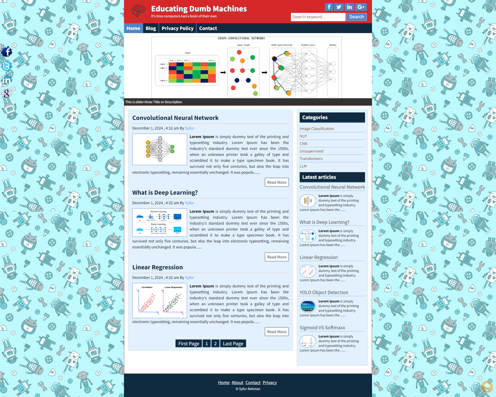
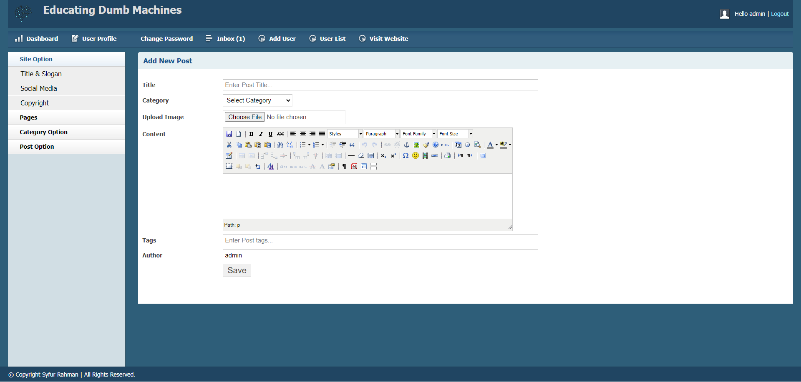

# Educating Dumb Machines

This is a blog application, developed with PHP Object Oriented Programming Concepts for CSE-2210: Web Engineering Lab Assignment

***it contains all the features and fucntionallity a blog should have, with the admin panel we can create new user update any post and recover forgotten password with email and many other features and fucntionallity***

## Front-End

## Admin Panel

